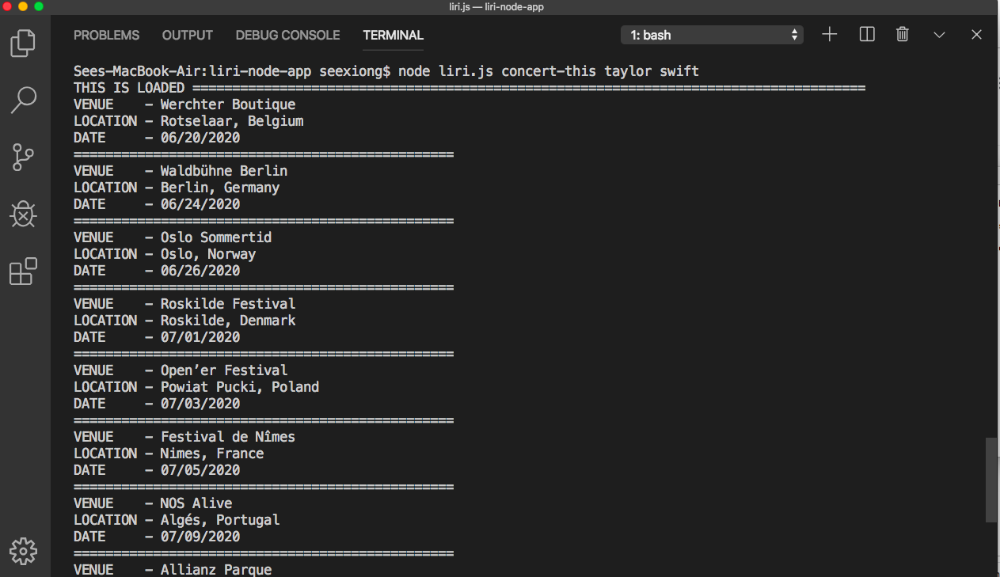

# LIRI Node App

LIRI is like iPhone's SIRI. LIRI stands for _Language Interpretation and Recognition Interface_.
This LIRI app will search Spotify for songs, Bands in Town for concerts, and OMDB for movies.
LIRI is a command line node app that takes in your **search term** and gives back information regarding **songs** , **concert**, or **movies**.

### Prerequisites
## If you want to use this app, you will need to create an account at Spotify and provide your own id and secret for it to work

You will need to have Node JS installed on your local computer to use this app.  To install Node JS, go to this website <https://nodejs.org/en/>.  Once Node JS is installed, followed the instructions below:
1. Clone the LIRI Node App repository onto your computer. Click [HERE](https://help.github.com/articles/cloning-a-repository/) for instructions to clone.  
2. Install npm modules. On your command line, type the following key words: `npm install node-spotify-api request moment dotenv`
3. Create a `.env` file on your root folder.  This is where you will save your spotify id and secret.
* The Spotify API requires you sign up as a developer to generate the necessary credentials. You can follow these steps in order to generate a **client id** and **client secret**:
* Step One: Visit <https://developer.spotify.com/my-applications/#!/>
* Step Two: Either login to your existing Spotify account or create a new one (a free account is fine) and log in.
* Step Three: Once logged in, navigate to <https://developer.spotify.com/my-applications/#!/applications/create> to register a new application to be used with the Spotify API. You can fill in whatever you'd like for these fields. When finished, click the "
* Step Four: On the next screen, scroll down to where you see your client id and client secret. Copy these values down somewhere, you'll need them to use the Spotify API and the [node-spotify-api package](https://www.npmjs.com/package/node-spotify-api).
* Save your spotify id and secret in your '.env' file

## Getting Started

1. After you successfully cloned the app, open terminal and navigate to the correct folder destination. In this case, it will be the `liri.js` file.

2. To search for concerts information, enter this command on your terminal or command line:
 `node liri.js concert-this "artist/band name here"` .

3. To search for songs and its information, enter this command on your terminal or command line:
`node liri.js spotify-this-song "song name here"` .

4. To search for movies, enter this command on your terminal or command line:
`node liri.js movie-this "movie name here"` .

## API Used

* [Node Spotify API](https://www.npmjs.com/package/node-spotify-api)
* [Bands in Town API](http://www.artists.bandsintown.com/bandsintown-api)
* [OMDB API](http://www.omdbapi.com/)

## Built With

* Node JS

## Authors

* See Xiong - _initial work_ - [seeseexiong]( https://github.com/seeseexiong)

## License

This project is licensed under University of Minnesota
