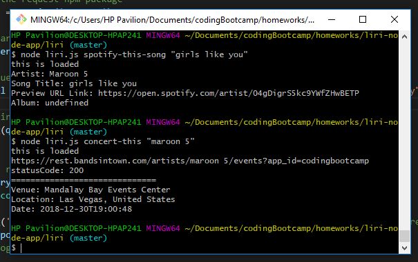
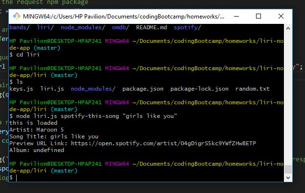
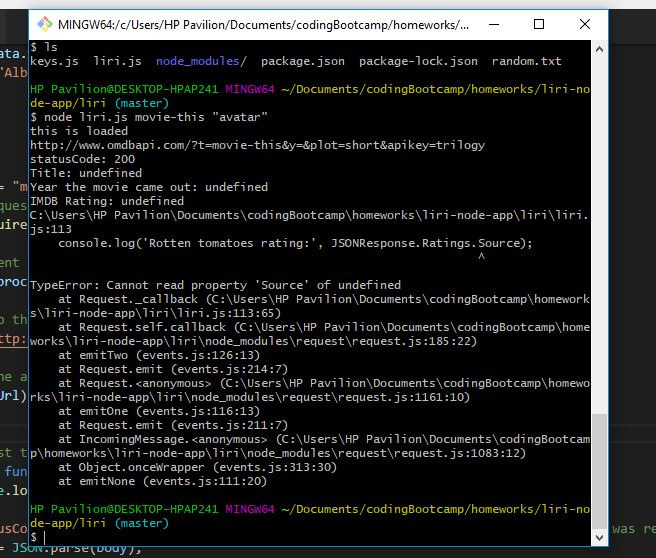

# LIRI Node App

LIRI is like iPhone's SIRI. LIRI stands for _Language Interpretation and Recognition Interface_.
This LIRI app will search Spotify for songs, Bands in Town for concerts, and OMDB for movies.
LIRI is a command line node app that takes in your **search term** and gives back information regarding **songs** , **concert**, or **movies**.

## If someone wanted to clone your app from github and run it themselves, they would need to supply their own .env file that contains their own spotify id and secret for it to work

### Prerequisites

You will need to have Node JS installed to use this app.

## Getting Started

To get started, clone the LIRI Node App repository onto your computer. Click [HERE](https://help.github.com/articles/cloning-a-repository/) for instructions to clone.  After you successfully cloned the app, open terminal and navigate to the correct folder destination. In this case, it will be the `liri.js` file.

1. To search for concerts information, enter this command on your terminal or command line:
 `node liri.js concert-this "artist/band name here"` .

2. To search for songs and its information, enter this command on your terminal or command line:
`node liri.js spotify-this-song "song name here"` .

3. To search for movies, enter this command on your terminal or command line:
`node liri.js movie-this "movie name here"` .

## API Used

* [Node Spotify API](https://www.npmjs.com/package/node-spotify-api)
* [Bands in Town API](http://www.artists.bandsintown.com/bandsintown-api)
* [OMDB API](http://www.omdbapi.com/)

## Built With

* Node JS

## Authors

* See Xiong - _initial work_ - [seeseexiong]( https://github.com/seeseexiong)

## License

This project is licensed under University of Minnesota
